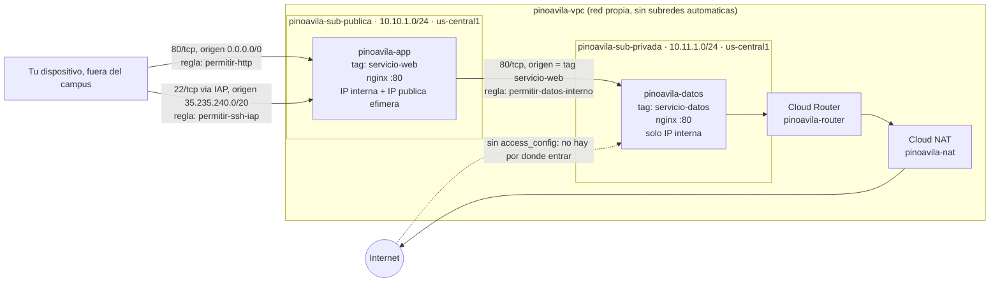

# PRACTICA3-RED
## 1. Identificación del equipo: Angely Sofia Pino 1152315, Jhan Ávila Torres 1152490
### 1.1. ID del proyecto: nube-practica-1-507220
## 2. Diagrama



Básicamente lo que hicimos fue esto: la app se puede alcanzar por dos puertas nada más (el 80 para el navegador y el 22 solo desde el rango de IAP), las dos controladas por la etiqueta `servicio-web`. La máquina de datos no tiene ninguna dirección a la que uno de afuera le pueda hablar, así que para instalar sus paquetes sale por el NAT, y solo le recibe algo a la máquina que tenga la etiqueta `servicio-web`.

## 3. Evidencias

### Evidencia 0: 
**Comando escrito: terraform version /**
**Salida:**

```
Terraform v1.5.7
on linux_amd64

Your version of Terraform is out of date! The latest version
is 1.16.3. You can update by downloading from https://www.terraform.io/downloads.html
```
*La versión dice que está desactualizada pero la dejamos así porque para la practica la versión de Terraform no es relevante (o por lo menos no hay una parte que exija cierta versión)*

**Comando escrito: gcloud config list /**
**Salida:**
```
angelysofiapg@cloudshell:~/PRACTICA-3-RED (nube-practica-1-507220)$  gcloud config list
[accessibility]
screen_reader = True
[component_manager]
disable_update_check = True
[compute]
gce_metadata_read_timeout_sec = 30
[core]
account = angelysofiapg@ufps.edu.co
disable_usage_reporting = False
project = nube-practica-1-507220
universe_domain = googleapis.com
[metrics]
environment = devshell
```
### Evidencia 1: 

**Comando escrito: terraform apply /**
**Salida:**
```
angelysofiapg@cloudshell:~/PRACTICA-3-RED (nube-practica-1-507220)$ terraform apply

Terraform used the selected providers to generate the following execution plan. Resource actions are indicated with the following symbols:
  + create

Terraform will perform the following actions:

  # google_compute_network.vpc will be created
  + resource "google_compute_network" "vpc" {
      + auto_create_subnetworks                   = false
      + bgp_always_compare_med                    = (known after apply)
      + bgp_best_path_selection_mode              = (known after apply)
      + bgp_inter_region_cost                     = (known after apply)
      + delete_bgp_always_compare_med             = false
      + delete_default_routes_on_create           = false
      + deletion_policy                           = "DELETE"
      + gateway_ipv4                              = (known after apply)
      + id                                        = (known after apply)
      + internal_ipv6_range                       = (known after apply)
      + mtu                                       = (known after apply)
      + name                                      = "pinoavila-vpc"
      + network_firewall_policy_enforcement_order = "AFTER_CLASSIC_FIREWALL"
      + network_id                                = (known after apply)
      + numeric_id                                = (known after apply)
      + project                                   = "nube-practica-1-507220"
      + routing_mode                              = (known after apply)
      + self_link                                 = (known after apply)
    }

  # google_compute_subnetwork.publica will be created
  + resource "google_compute_subnetwork" "publica" {
      + allow_subnet_cidr_routes_overlap = (known after apply)
      + creation_timestamp               = (known after apply)
      + deletion_policy                  = "DELETE"
      + external_ipv6_prefix             = (known after apply)
      + fingerprint                      = (known after apply)
      + gateway_address                  = (known after apply)
      + id                               = (known after apply)
      + internal_ipv6_prefix             = (known after apply)
      + ip_cidr_range                    = "10.10.1.0/24"
      + ipv6_cidr_range                  = (known after apply)
      + ipv6_gce_endpoint                = (known after apply)
      + name                             = "pinoavila-sub-publica"
      + network                          = (known after apply)
      + private_ip_google_access         = (known after apply)
      + private_ipv6_google_access       = (known after apply)
      + project                          = "nube-practica-1-507220"
      + purpose                          = (known after apply)
      + region                           = "us-central1"
      + self_link                        = (known after apply)
      + stack_type                       = (known after apply)
      + state                            = (known after apply)
      + subnetwork_id                    = (known after apply)
    }

Plan: 2 to add, 0 to change, 0 to destroy.

Do you want to perform these actions?
  Terraform will perform the actions described above.
  Only 'yes' will be accepted to approve.

  Enter a value: yes
```
En este último bloque, nos indica que se creó la red vpc "pinoavila-vpc" y la sub red "pinoavila-sub-publica" 

*la imagen de evidencia se encuentra en la carpeta "evidencias" como "evidencia 1"*
```
google_compute_network.vpc: Creating...
google_compute_network.vpc: Still creating... [10s elapsed]
google_compute_network.vpc: Creation complete after 12s [id=projects/nube-practica-1-507220/global/networks/pinoavila-vpc]
google_compute_subnetwork.publica: Creating...
google_compute_subnetwork.publica: Still creating... [10s elapsed]
google_compute_subnetwork.publica: Creation complete after 11s [id=projects/nube-practica-1-507220/regions/us-central1/subnetworks/pinoavila-sub-publica]
```
### Evidencia 2: 
**Comando escrito: terraform plan**

```
angelysofiapg@cloudshell:~/PRACTICA-3-RED (nube-practica-1-507220)$  terraform plan
google_compute_network.vpc: Refreshing state... [id=projects/nube-practica-1-507220/global/networks/pinoavila-vpc]
google_compute_subnetwork.publica: Refreshing state... [id=projects/nube-practica-1-507220/regions/us-central1/subnetworks/pinoavila-sub-publica]

No changes. Your infrastructure matches the configuration.


Terraform has compared your real infrastructure against your configuration and
found no differences, so no changes are needed.
angelysofiapg@cloudshell:~/PRACTICA-3-RED (nube-practica-1-507220)$ 
```
**Comando escrito: terraform output**
```
red = "pinoavila-vpc"ell:~/PRACTICA-3-RED (nube-practica-1-507220)$ terraform output
subred_publica = "https://www.googleapis.com/compute/v1/projects/nube-practica-1-507220/regions/us-central1/subnetworks/pinoavila-sub-publica"
angelysofiapg@cloudshell:~/PRACTICA-3-RED (nube-practica-1-507220)$ 
```
### Evidencia 3: 

Las imágenes de evidencia están en la carpeta *"evidencias"* como *"evidencia 3" y "evidencia 3.1"*

### Evidencia 4: 

**Comando escrito: gcloud compute ssh pinoavila-app --tunnel-through-iap**
```
angelysofiapg@cloudshell:~/PRACTICA-3-RED (nube-practica-1-507220)$  gcloud compute ssh pinoavila-app --tunnel-through-iap
WARNING: The private SSH key file for gcloud does not exist.
WARNING: The public SSH key file for gcloud does not exist.
WARNING: You do not have an SSH key for gcloud.
WARNING: SSH keygen will be executed to generate a key.
This tool needs to create the directory [/home/angelysofiapg/.ssh] before being able to generate SSH keys.

Do you want to continue (Y/n)?  y

Generating public/private rsa key pair.
Enter passphrase (empty for no passphrase): 
Enter same passphrase again: 
Your identification has been saved in /home/angelysofiapg/.ssh/google_compute_engine
Your public key has been saved in /home/angelysofiapg/.ssh/google_compute_engine.pub
The key fingerprint is:
SHA256:AqGY2ohqgHHWish7WL9c2UI+HiTaFwg8FnLfhY3JBLk angelysofiapg@cs-1096672498634-default
The key's randomart image is:
+---[RSA 3072]----+
| . o..=.=.       |
| o+ooo.=..       |
|+ +=o...         |
|*B..oE.          |
|O.o. o.+S        |
|o + + =.+        |
|.+ o o O .       |
|. . . = +        |
|     o .         |
+----[SHA256]-----+
Did you mean zone [us-east1-c] for instance: [pinoavila-app] (Y/n)?  n

No zone specified. Using zone [us-central1-a] for instance: [pinoavila-app].
Updating project ssh metadata...workingUpdated [https://www.googleapis.com/compute/v1/projects/nube-practica-1-507220].                                                 
Updating project ssh metadata...done.                                                                                                                                   
Waiting for SSH key to propagate.
WARNING: 

To increase the performance of the tunnel, consider installing NumPy. For instructions,
please see https://cloud.google.com/iap/docs/using-tcp-forwarding#increasing_the_tcp_upload_bandwidth

Warning: Permanently added 'compute.7098409224690186192' (ED25519) to the list of known hosts.
Enter passphrase for key '/home/angelysofiapg/.ssh/google_compute_engine': 
WARNING: 

To increase the performance of the tunnel, consider installing NumPy. For instructions,
please see https://cloud.google.com/iap/docs/using-tcp-forwarding#increasing_the_tcp_upload_bandwidth

Enter passphrase for key '/home/angelysofiapg/.ssh/google_compute_engine': 
Linux pinoavila-app 6.1.0-53-cloud-amd64 #1 SMP PREEMPT_DYNAMIC Debian 6.1.187-1 (2026-09-07) x86_64

The programs included with the Debian GNU/Linux system are free software;
the exact distribution terms for each program are described in the
individual files in /usr/share/doc/*/copyright.

Debian GNU/Linux comes with ABSOLUTELY NO WARRANTY, to the extent
permitted by applicable law.
angelysofiapg@pinoavila-app:~$
```

**Evidencia 4.1 y 4.2 (firewall y capture del sitio)**
Se encuentran en la carpeta "evidencias".

### Evidencia 5: 

**Comando escrito: terraform destroy**
```
angelysofiapg@cloudshell:~/PRACTICA-3-RED (nube-practica-1-507220)$ terraform destroy
google_compute_network.vpc: Refreshing state... [id=projects/nube-practica-1-507220/global/networks/pinoavila-vpc]
google_compute_firewall.app_http: Refreshing state... [id=projects/nube-practica-1-507220/global/firewalls/pinoavila-permitir-http]
google_compute_subnetwork.publica: Refreshing state... [id=projects/nube-practica-1-507220/regions/us-central1/subnetworks/pinoavila-sub-publica]
google_compute_firewall.ssh_iap: Refreshing state... [id=projects/nube-practica-1-507220/global/firewalls/pinoavila-permitir-ssh-iap]
google_compute_instance.app: Refreshing state... [id=projects/nube-practica-1-507220/zones/us-central1-a/instances/pinoavila-app]

Terraform used the selected providers to generate the following execution plan. Resource actions are indicated with the following symbols:
  - destroy

Terraform will perform the following actions:

  # google_compute_firewall.app_http will be destroyed
  - resource "google_compute_firewall" "app_http" {
      - creation_timestamp      = "2026-09-18T21:40:33.290-07:00" -> null
      - deletion_policy         = "DELETE" -> null
      - destination_ranges      = [] -> null
      - direction               = "INGRESS" -> null
      - disabled                = false -> null
      - id                      = "projects/nube-practica-1-507220/global/firewalls/pinoavila-permitir-http" -> null
      - name                    = "pinoavila-permitir-http" -> null
      - network                 = "https://www.googleapis.com/compute/v1/projects/nube-practica-1-507220/global/networks/pinoavila-vpc" -> null
      - priority                = 1000 -> null
      - project                 = "nube-practica-1-507220" -> null
      - self_link               = "https://www.googleapis.com/compute/v1/projects/nube-practica-1-507220/global/firewalls/pinoavila-permitir-http" -> null
      - source_ranges           = [
          - "0.0.0.0/0",
        ] -> null
      - source_service_accounts = [] -> null
      - source_tags             = [] -> null
      - target_service_accounts = [] -> null
      - target_tags             = [
          - "servicio-web",
        ] -> null

      - allow {
          - ports    = [
              - "80",
            ] -> null
          - protocol = "tcp" -> null
        }
    }

  # google_compute_firewall.ssh_iap will be destroyed
  - resource "google_compute_firewall" "ssh_iap" {
      - creation_timestamp      = "2026-09-18T21:40:32.651-07:00" -> null
      - deletion_policy         = "DELETE" -> null
      - destination_ranges      = [] -> null
      - direction               = "INGRESS" -> null
      - disabled                = false -> null
      - id                      = "projects/nube-practica-1-507220/global/firewalls/pinoavila-permitir-ssh-iap" -> null
      - name                    = "pinoavila-permitir-ssh-iap" -> null
      - network                 = "https://www.googleapis.com/compute/v1/projects/nube-practica-1-507220/global/networks/pinoavila-vpc" -> null
      - priority                = 1000 -> null
      - project                 = "nube-practica-1-507220" -> null
      - self_link               = "https://www.googleapis.com/compute/v1/projects/nube-practica-1-507220/global/firewalls/pinoavila-permitir-ssh-iap" -> null
      - source_ranges           = [
          - "35.235.240.0/20",
        ] -> null
      - source_service_accounts = [] -> null
      - source_tags             = [] -> null
      - target_service_accounts = [] -> null
      - target_tags             = [
          - "servicio-web",
        ] -> null

      - allow {
          - ports    = [
              - "22",
            ] -> null
          - protocol = "tcp" -> null
        }
    }

  # google_compute_instance.app will be destroyed
  - resource "google_compute_instance" "app" {
      - can_ip_forward          = false -> null
      - cpu_platform            = "AMD Rome" -> null
      - creation_timestamp      = "2026-09-18T21:02:07.936-07:00" -> null
      - current_status          = "RUNNING" -> null
      - deletion_policy         = "DELETE" -> null
      - deletion_protection     = false -> null
      - effective_labels        = {
          - "goog-terraform-provisioned" = "true"
        } -> null
      - enable_display          = false -> null
      - id                      = "projects/nube-practica-1-507220/zones/us-central1-a/instances/pinoavila-app" -> null
      - instance_id             = "7098409224690186192" -> null
      - label_fingerprint       = "vezUS-42LLM=" -> null
      - labels                  = {} -> null
      - machine_type            = "e2-micro" -> null
      - metadata                = {} -> null
      - metadata_fingerprint    = "9juv6rCcTyI=" -> null
      - metadata_startup_script = <<-EOT
            #!/bin/bash
            apt-get update -y
            apt-get install -y nginx
            INTERNA=$(curl -s -H "Metadata-Flavor: Google" \
              http://metadata.google.internal/computeMetadata/v1/instance/network-interfaces/0/ip)
            cat > /var/www/html/index.html <<HTML
            <h1>1152315-1152490</h1>
            <p>Servidor de aplicación. IP interna: $INTERNA</p>
            HTML
        EOT -> null
      - name                    = "pinoavila-app" -> null
      - project                 = "nube-practica-1-507220" -> null
      - resource_policies       = [] -> null
      - self_link               = "https://www.googleapis.com/compute/v1/projects/nube-practica-1-507220/zones/us-central1-a/instances/pinoavila-app" -> null
      - tags                    = [
          - "servicio-web",
        ] -> null
      - tags_fingerprint        = "aesi9iE0ehc=" -> null
      - terraform_labels        = {
          - "goog-terraform-provisioned" = "true"
        } -> null
      - zone                    = "us-central1-a" -> null

      - boot_disk {
          - auto_delete       = true -> null
          - device_name       = "persistent-disk-0" -> null
          - force_attach      = false -> null
          - guest_os_features = [
              - "UEFI_COMPATIBLE",
              - "VIRTIO_SCSI_MULTIQUEUE",
              - "GVNIC",
              - "SEV_CAPABLE",
              - "SEV_LIVE_MIGRATABLE_V2",
            ] -> null
          - mode              = "READ_WRITE" -> null
          - source            = "https://www.googleapis.com/compute/v1/projects/nube-practica-1-507220/zones/us-central1-a/disks/pinoavila-app" -> null

          - initialize_params {
              - architecture                = "X86_64" -> null
              - enable_confidential_compute = false -> null
              - image                       = "https://www.googleapis.com/compute/v1/projects/debian-cloud/global/images/debian-12-bookworm-v20260908" -> null
              - labels                      = {} -> null
              - provisioned_iops            = 0 -> null
              - provisioned_throughput      = 0 -> null
              - replica_zones               = [] -> null
              - resource_manager_tags       = {} -> null
              - resource_policies           = [] -> null
              - size                        = 10 -> null
              - type                        = "pd-standard" -> null
            }
        }

      - network_interface {
          - internal_ipv6_prefix_length = 0 -> null
          - name                        = "nic0" -> null
          - network                     = "https://www.googleapis.com/compute/v1/projects/nube-practica-1-507220/global/networks/pinoavila-vpc" -> null
          - network_ip                  = "10.10.1.2" -> null
          - queue_count                 = 0 -> null
          - stack_type                  = "IPV4_ONLY" -> null
          - subnetwork                  = "https://www.googleapis.com/compute/v1/projects/nube-practica-1-507220/regions/us-central1/subnetworks/pinoavila-sub-publica" -> null
          - subnetwork_project          = "nube-practica-1-507220" -> null
          - vlan                        = 0 -> null

          - access_config {
              - nat_ip       = "34.56.124.28" -> null
              - network_tier = "PREMIUM" -> null
            }
        }

      - scheduling {
          - automatic_restart          = true -> null
          - availability_domain        = 0 -> null
          - host_error_timeout_seconds = 0 -> null
          - min_node_cpus              = 0 -> null
          - on_host_maintenance        = "MIGRATE" -> null
          - preemptible                = false -> null
          - provisioning_model         = "STANDARD" -> null
        }

      - shielded_instance_config {
          - enable_integrity_monitoring = true -> null
          - enable_secure_boot          = false -> null
          - enable_vtpm                 = true -> null
        }
    }

  # google_compute_network.vpc will be destroyed
  - resource "google_compute_network" "vpc" {
      - auto_create_subnetworks                   = false -> null
      - bgp_always_compare_med                    = false -> null
      - bgp_best_path_selection_mode              = "LEGACY" -> null
      - delete_bgp_always_compare_med             = false -> null
      - delete_default_routes_on_create           = false -> null
      - deletion_policy                           = "DELETE" -> null
      - enable_ula_internal_ipv6                  = false -> null
      - id                                        = "projects/nube-practica-1-507220/global/networks/pinoavila-vpc" -> null
      - mtu                                       = 0 -> null
      - name                                      = "pinoavila-vpc" -> null
      - network_firewall_policy_enforcement_order = "AFTER_CLASSIC_FIREWALL" -> null
      - network_id                                = "8833539663965741925" -> null
      - numeric_id                                = "8833539663965741925" -> null
      - project                                   = "nube-practica-1-507220" -> null
      - routing_mode                              = "REGIONAL" -> null
      - self_link                                 = "https://www.googleapis.com/compute/v1/projects/nube-practica-1-507220/global/networks/pinoavila-vpc" -> null
    }

  # google_compute_subnetwork.publica will be destroyed
  - resource "google_compute_subnetwork" "publica" {
      - allow_subnet_cidr_routes_overlap = false -> null
      - creation_timestamp               = "2026-09-18T17:55:50.060-07:00" -> null
      - deletion_policy                  = "DELETE" -> null
      - gateway_address                  = "10.10.1.1" -> null
      - id                               = "projects/nube-practica-1-507220/regions/us-central1/subnetworks/pinoavila-sub-publica" -> null
      - ip_cidr_range                    = "10.10.1.0/24" -> null
      - name                             = "pinoavila-sub-publica" -> null
      - network                          = "https://www.googleapis.com/compute/v1/projects/nube-practica-1-507220/global/networks/pinoavila-vpc" -> null
      - private_ip_google_access         = false -> null
      - private_ipv6_google_access       = "DISABLE_GOOGLE_ACCESS" -> null
      - project                          = "nube-practica-1-507220" -> null
      - purpose                          = "PRIVATE" -> null
      - region                           = "us-central1" -> null
      - self_link                        = "https://www.googleapis.com/compute/v1/projects/nube-practica-1-507220/regions/us-central1/subnetworks/pinoavila-sub-publica" -> null
      - stack_type                       = "IPV4_ONLY" -> null
      - subnetwork_id                    = 8799317995911407000 -> null
    }

Plan: 0 to add, 0 to change, 5 to destroy.

Changes to Outputs:
  - ip_publica     = "34.56.124.28" -> null
  - red            = "pinoavila-vpc" -> null
  - subred_publica = "https://www.googleapis.com/compute/v1/projects/nube-practica-1-507220/regions/us-central1/subnetworks/pinoavila-sub-publica" -> null

Do you really want to destroy all resources?
  Terraform will destroy all your managed infrastructure, as shown above.
  There is no undo. Only 'yes' will be accepted to confirm.

  Enter a value: yes

google_compute_firewall.ssh_iap: Destroying... [id=projects/nube-practica-1-507220/global/firewalls/pinoavila-permitir-ssh-iap]
google_compute_firewall.app_http: Destroying... [id=projects/nube-practica-1-507220/global/firewalls/pinoavila-permitir-http]
google_compute_instance.app: Destroying... [id=projects/nube-practica-1-507220/zones/us-central1-a/instances/pinoavila-app]
google_compute_firewall.app_http: Still destroying... [id=projects/nube-practica-1-507220/global/firewalls/pinoavila-permitir-http, 10s elapsed]
google_compute_firewall.ssh_iap: Still destroying... [id=projects/nube-practica-1-507220/global/firewalls/pinoavila-permitir-ssh-iap, 10s elapsed]
google_compute_instance.app: Still destroying... [id=projects/nube-practica-1-507220/zones/us-central1-a/instances/pinoavila-app, 10s elapsed]
google_compute_firewall.ssh_iap: Destruction complete after 11s
google_compute_firewall.app_http: Destruction complete after 11s
google_compute_instance.app: Still destroying... [id=projects/nube-practica-1-507220/zones/us-central1-a/instances/pinoavila-app, 20s elapsed]
google_compute_instance.app: Destruction complete after 21s
google_compute_subnetwork.publica: Destroying... [id=projects/nube-practica-1-507220/regions/us-central1/subnetworks/pinoavila-sub-publica]
google_compute_subnetwork.publica: Still destroying... [id=projects/nube-practica-1-507220/regions...ral1/subnetworks/pinoavila-sub-publica, 10s elapsed]
google_compute_subnetwork.publica: Destruction complete after 11s
google_compute_network.vpc: Destroying... [id=projects/nube-practica-1-507220/global/networks/pinoavila-vpc]
google_compute_network.vpc: Still destroying... [id=projects/nube-practica-1-507220/global/networks/pinoavila-vpc, 10s elapsed]
google_compute_network.vpc: Still destroying... [id=projects/nube-practica-1-507220/global/networks/pinoavila-vpc, 20s elapsed]
google_compute_network.vpc: Still destroying... [id=projects/nube-practica-1-507220/global/networks/pinoavila-vpc, 30s elapsed]
google_compute_network.vpc: Destruction complete after 31s

Destroy complete! Resources: 5 destroyed.
angelysofiapg@cloudshell:~/PRACTICA-3-RED (nube-practica-1-507220)$ 
```
**comando escrito: gcloud compute instances list**
```
angelysofiapg@cloudshell:~/PRACTICA-3-RED (nube-practica-1-507220)$ gcloud compute instances list
Listed 0 items.
```

**Comando escrito: gcloud compute networks list**
```
angelysofiapg@cloudshell:~/PRACTICA-3-RED (nube-practica-1-507220)$ gcloud compute networks list
NAME: default
SUBNET_MODE: AUTO
BGP_ROUTING_MODE: REGIONAL
IPV4_RANGE: 
GATEWAY_IPV4: 
INTERNAL_IPV6_RANGE: 
```

**Comando escrito: terraform apply**
```
 Enter a value: yes

google_compute_network.vpc: Creating...
google_compute_network.vpc: Still creating... [10s elapsed]
google_compute_network.vpc: Still creating... [20s elapsed]
google_compute_network.vpc: Still creating... [30s elapsed]
google_compute_network.vpc: Creation complete after 32s [id=projects/nube-practica-1-507220/global/networks/pinoavila-vpc]
google_compute_firewall.ssh_iap: Creating...
google_compute_subnetwork.publica: Creating...
google_compute_firewall.app_http: Creating...
google_compute_subnetwork.publica: Still creating... [10s elapsed]
google_compute_firewall.ssh_iap: Still creating... [10s elapsed]
google_compute_firewall.app_http: Still creating... [10s elapsed]
google_compute_firewall.ssh_iap: Creation complete after 11s [id=projects/nube-practica-1-507220/global/firewalls/pinoavila-permitir-ssh-iap]
google_compute_firewall.app_http: Creation complete after 11s [id=projects/nube-practica-1-507220/global/firewalls/pinoavila-permitir-http]
google_compute_subnetwork.publica: Creation complete after 11s [id=projects/nube-practica-1-507220/regions/us-central1/subnetworks/pinoavila-sub-publica]
google_compute_instance.app: Creating...
google_compute_instance.app: Still creating... [10s elapsed]
google_compute_instance.app: Creation complete after 18s [id=projects/nube-practica-1-507220/zones/us-central1-a/instances/pinoavila-app]

Apply complete! Resources: 5 added, 0 changed, 0 destroyed.

Outputs:

ip_publica = "34.46.138.226"
red = "pinoavila-vpc"
subred_publica = "https://www.googleapis.com/compute/v1/projects/nube-practica-1-507220/regions/us-central1/subnetworks/pinoavila-sub-publica"
angelysofiapg@cloudshell:~/PRACTICA-3-RED (nube-practica-1-507220)$ 
```
**Nueva ip: "34.46.138.226"**
**Ip vieja: "34.56.124.28"**

*Hay dos evidencias fotográficas de esto en la carpeta evidencias*

### Evidencia 6: 

**Reto de la semana: la máquina que nadie puede alcanzar**

**Comando escrito: terraform apply /**
**Salida:**
```
jhan_4_fran_t@cloudshell:~/PRACTICA-3-RED (nube-practica-1-507220)$ terraform apply

[... el plan completo, con los 10 recursos a crear: google_compute_network.vpc,
google_compute_subnetwork.publica, google_compute_subnetwork.privada,
google_compute_instance.app, google_compute_instance.datos,
google_compute_firewall.app_http, google_compute_firewall.ssh_iap,
google_compute_firewall.datos_interno, google_compute_router.router y
google_compute_router_nat.nat. Las capturas completas del plan están en
"evidencias" como "Evidencia 6.1.1" a "Evidencia 6.1.8" ...]

Plan: 10 to add, 0 to change, 0 to destroy.

Do you want to perform these actions?
  Enter a value: yes

google_compute_network.vpc: Creating...
google_compute_network.vpc: Creation complete after 21s [id=projects/nube-practica-1-507220/global/networks/pinoavila-vpc]
google_compute_firewall.app_http: Creating...
google_compute_firewall.ssh_iap: Creating...
google_compute_router.router: Creating...
google_compute_subnetwork.privada: Creating...
google_compute_subnetwork.publica: Creating...
google_compute_firewall.datos_interno: Creating...
google_compute_subnetwork.privada: Creation complete after 11s [id=.../pinoavila-sub-privada]
google_compute_instance.datos: Creating...
google_compute_subnetwork.publica: Creation complete after 12s [id=.../pinoavila-sub-publica]
google_compute_router.router: Creation complete after 12s [id=.../pinoavila-router]
google_compute_router_nat.nat: Creating...
google_compute_firewall.ssh_iap: Creation complete after 12s
google_compute_firewall.app_http: Creation complete after 22s
google_compute_firewall.datos_interno: Creation complete after 22s
google_compute_router_nat.nat: Creation complete after 12s [id=.../pinoavila-nat]
google_compute_instance.datos: Creation complete after 27s [id=.../pinoavila-datos]
google_compute_instance.app: Creating...
google_compute_instance.app: Creation complete after 28s [id=.../pinoavila-app]

Apply complete! Resources: 10 added, 0 changed, 0 destroyed.

Outputs:

ip_interna_datos = "10.11.1.2"
ip_publica = "35.202.57.254"
red = "pinoavila-vpc"
subred_publica = "https://www.googleapis.com/compute/v1/projects/nube-practica-1-507220/regions/us-central1/subnetworks/pinoavila-sub-publica"
```
Algo que vale la pena señalar de este log: `google_compute_instance.datos` terminó de crearse ("Creation complete after 27s") **antes** de que `google_compute_instance.app` siquiera empezara ("Creating..."). Eso no lo pusimos nosotros a mano, es la dependencia real: el `templatefile()` del script de la app necesita la IP interna de `datos`, así que Terraform no tuvo más remedio que crear primero una y después la otra.

**Comando escrito: gcloud compute instances describe pinoavila-datos --zone=us-central1-a --format="get(networkInterfaces[0].accessConfigs)" /**
**Salida:**
```
jhan_4_fran_t@cloudshell:~/PRACTICA-3-RED (nube-practica-1-507220)$ gcloud compute instances describe pinoavila-datos --zone=us-central1-a \
  --format="get(networkInterfaces[0].accessConfigs)"

jhan_4_fran_t@cloudshell:~/PRACTICA-3-RED (nube-practica-1-507220)$ 
```
No imprimió nada. Esa es la prueba de que `pinoavila-datos` no tiene ningún `accessConfig`, o sea, ninguna IP pública.

**Prueba del aislamiento, entrando por SSH con IAP a `pinoavila-app` y desde ahí probando contra la IP interna de `pinoavila-datos`:**
```
jhan_4_fran_t@cloudshell:~/PRACTICA-3-RED (nube-practica-1-507220)$ gcloud compute ssh pinoavila-app --zone=us-central1-a --tunnel-through-iap
[...]
jhan_4_fran_t@pinoavila-app:~$ curl -m 8 http://10.11.1.2:22
curl -m 8 http://10.11.1.2/dato.txt
curl: (28) Connection timed out after 8001 milliseconds
dato-servido-desde-la-maquina-privada-1152315-1152490
```
El primer `curl`, contra el puerto 22 (que la regla `datos_interno` no permite), se quedó esperando hasta agotar el tiempo: el paquete lo descarta el cortafuegos en silencio, no hay ningún servicio que lo rechace. El segundo, contra el puerto 80 (el único que sí permite la regla, y solo desde la etiqueta `servicio-web`), respondió con el texto exacto que sirve `arranque_datos.sh`.

**El dato en la página:**
Entrando a `http://35.202.57.254` desde el celular, con datos móviles y no con el wifi del campus, la página mostró:

> 1152315-1152490
> Servidor de aplicación. IP interna: 10.10.1.2
> Dato recibido de la máquina de datos (10.11.x.x, sin IP pública): dato-servido-desde-la-maquina-privada-1152315-1152490

*Las imágenes de esta evidencia están en la carpeta "evidencias": "Evidencia 6.1.1" a "Evidencia 6.1.8" (el plan y la creación completos), "Evidencia 6.2" (el `accessConfigs` vacío), "Evidencia 6.3" (la sesión SSH con los dos `curl`) y "Evidencia 6.4" (la página final desde el celular).*

## 4. Comandos ejecutados

Aquí dejamos solo los comandos, sin la salida (la salida completa ya está en cada evidencia arriba):

```
# Fase 0
terraform version
gcloud config list
gcloud services enable compute.googleapis.com
git clone https://github.com/<usuario>/practica-3-red.git

# Fase 1
terraform init
terraform plan
terraform apply

# Fase 2
terraform plan
terraform apply
terraform output

# Fase 3 y 4
terraform apply
curl -m 8 http://<IP-PUBLICA>
gcloud compute ssh pinoavila-app --tunnel-through-iap

# Fase 5
terraform destroy
gcloud compute instances list
gcloud compute networks list
terraform apply

# Fase 6
terraform plan
terraform apply
gcloud compute instances describe pinoavila-datos --zone=us-central1-a --format="get(networkInterfaces[0].accessConfigs)"
gcloud compute ssh pinoavila-app --zone=us-central1-a --tunnel-through-iap
curl -m 8 http://10.11.1.2:22
curl -m 8 http://10.11.1.2/dato.txt
```

## 5. Decisiones libres justificadas

### 5.1 Sobre la máquina: 
Aunque el uso en esta práctica es pequeño, y más o menos teníamos entendido el tipo de máquina que teníamos que escoger quisimos hacer la trazabilidad de comparar las diferentes  máquinas y poder decir cuál era adecuada para nuestro trabajo. Google cloud tiene docs que informan tanto para la zona como para máquinas: https://docs.cloud.google.com/compute/docs/machine-resource?hl=es-419
. En ese sitio leímos las diferentes máquinas que tienen, y terminamos escogiendo de la serie E2 la e2-micro. 

*Citando del sitio: "Las series E2 y N1 contienen tipos de máquina con núcleo compartido. Estos tipos de máquinas comparten un núcleo físico, que puede ser un método rentable para ejecutar apps pequeñas que no necesitan muchos recursos"*

Otra razón para escoger e2-micro es que estamos trabajando con créditos gratuitos, haciendo mini poryectos que no van a tener mucho tráfico y probablemente para este proceso de la practica no se usará tanta ram. Aunque es cierto que f1-micro tiene menos ram google cloud ya tiene en su capa gratuita a e2-micro. No hay razón de dinero de por medio para elegir f1-micro sobre e2-micro. 

### 5.2. Sobre la zona

Por el lado de la zona, nosotros decidimos trabajar primero basado en la región en la que estamos, ya que una región diferente a la zona podría generar fallos en el apply, ya que la teoría dice que una zona es una "área aislada" dentro de una región. Entonces, basado en eso pusimos el comando: 

```
gcloud compute zones list --filter="region:us-central1"
```
Este basicamente nos dice las zonas filtradas por la región que trabajamos, en este caso, "us-central1". En donde nos dió las siguientes zonas: 

```
NAME: us-central1-c
REGION: us-central1
STATUS: UP
NEXT_MAINTENANCE: 
TURNDOWN_DATE: 

NAME: us-central1-a
REGION: us-central1
STATUS: UP
NEXT_MAINTENANCE: 
TURNDOWN_DATE: 

NAME: us-central1-f
REGION: us-central1
STATUS: UP
NEXT_MAINTENANCE: 
TURNDOWN_DATE: 

NAME: us-central1-b
REGION: us-central1
STATUS: UP
NEXT_MAINTENANCE: 
TURNDOWN_DATE: 
```
Como ya sabíamos el tipo de máquina filtramos en esas zonas si alguna tenía la máquina que requeríamos:

```
angelysofiapg@cloudshell:~/PRACTICA-3-RED (nube-practica-1-507220)$ gcloud compute machine-types list --zones=us-central1-a --filter="name=e2-micro"
NAME: e2-micro
ZONE: us-central1-a
CPUS: 2
MEMORY_GB: 1.00
DEPRECATED: 
```
Aquí mostrams con us-central1-a pero tanto b,c y f daban el mismo resultado. Utilizamos entonces la zona **us-central1-a**. No encontramos información comparativa sobre la disponibilidad de estas zonas, o otros criterios para elegir una sobre otra. 

### 5.3 Sobre la cdri privada
Esta era la parte más difícil (porque no recordabamos), para esto nos tocó repasar teoría. En donde después propusimos la red privada: 10.11.1.0/24

**¿Por qué ese valor?**

El /24 fija los primeros 24 bits, es decir, los tres primeros octetos: 10.10.1. El último octeto es la parte libre y puede valer de 0 a 255. Por eso el rango completo va de 10.10.1.0 a 10.10.1.255. Cualquier red sugerida dentro de ese rango va a solapar.

*y para confirmar, utilizamos un pequeño truco:*
```
python3 -c "import ipaddress; print(ipaddress.ip_network('10.10.1.0/24').overlaps(ipaddress.ip_network('10.11.1.0/24')))"
False
```
Esto si nos da true nos permite determinar si una ip sobrepone otra.

### 5.4 sobre el puerto y el source_ranges
En el hueco se coloca el puerto 80 porque en esta regla definimos quiénes pueden ver nuestra página web, para acceder a http por defecto es el puerto 80. Además, como queremos que "cualquiera de internet" pueda entrar a nuestra página web ponemos: "0.0.0.0/0" el /0 no fija ningún bit, por lo que permite a todas las direcciones. 

## 6. Preguntas respondidas

**1. Si le quitas la etiqueta de red a la máquina de aplicación y aplicas, ¿qué deja de funcionar exactamente, y por qué la regla de cortafuegos sigue existiendo?**

Deja de funcionar todo el acceso de afuera: ni el navegador entra por el 80 ni el `gcloud compute ssh --tunnel-through-iap` entra por el 22, porque las dos reglas (`permitir-http` y `permitir-ssh-iap`) usan `target_tags = ["servicio-web"]` para saber a qué máquina aplicarse, y si le quitamos la etiqueta a `pinoavila-app` esa máquina ya no encaja en ninguna de las dos. Pero la regla no se borra ni deja de existir: sigue estando ahí, en la VPC, con su mismo origen y su mismo puerto, solo que ya no tiene a quién aplicarse. Es la misma trampa que ya nos habían advertido con `tags` vs `labels`: la regla vive del lado de la red y la etiqueta del lado de la máquina, y lo único que las conecta es que coincidan.

**2. ¿Por qué el `plan` de la fase 2 no propuso ningún cambio, si el código era distinto? ¿Qué habrías tenido que cambiar para que sí propusiera recrear un recurso?**

Porque en la fase 2 no tocamos ningún valor real, solo movimos lo que ya estaba escrito a mano hacia variables con el mismo valor de por defecto, y agregamos `outputs.tf`. Terraform no compara un archivo contra el otro, compara la infraestructura que ya existe contra lo que el código describe en ese momento, y como al final la descripción daba exactamente lo mismo (mismo nombre, mismo rango, misma región), no había nada que cambiar. Para que sí propusiera recrear algo habríamos tenido que cambiar el valor de un atributo que el proveedor no deja modificar sin recrear el recurso, por ejemplo el `ip_cidr_range` de la subred o el `name` de la VPC; esos son los que el `plan` marca como reemplazo forzado.

**3. Con la red completa encendida, ¿cuánto costaría un mes?**

Buscando en el catálogo de precios de Google Cloud para `us-central1` (sin contar la capa gratuita ni descuentos, y suponiendo las dos máquinas prendidas el mes completo):

- Las dos instancias `e2-micro` (`pinoavila-app` y `pinoavila-datos`): normalmente caen dentro de la capa gratuita de GCP si es la única e2-micro que corre en el proyecto; si no, cada una ronda los US$6-7 al mes.
- Los dos discos de arranque de 10 GB `pd-standard`: casi nada, menos de US$1 entre los dos.
- La IP pública efímera de `pinoavila-app`: no cobra aparte mientras esté asignada a una instancia encendida.
- El Cloud Router: no tiene costo propio.
- El Cloud NAT: este fue el que más nos sorprendió. Cobra por hora de gateway (más o menos US$1-1,50 al mes solo por existir) más una tarifa por cada GB que procese, aunque la máquina de datos casi no genere tráfico.

Sumando todo, el mes quedaría en algo entre US$2 y US$16 dependiendo de si las e2-micro entran o no en la capa gratuita. Lo que más nos llamó la atención es justo el NAT: es el único recurso de toda la lista que cobra por estar desplegado y no por lo que hace, así que dejarlo prendido un fin de semana sin usarlo sí se nota en la factura. Por eso tiene sentido que la práctica insista tanto en el `destroy` al terminar de trabajar.

*(Esto es un cálculo aproximado con los precios públicos que encontramos, no lo sacamos de la calculadora de precios oficial con los datos exactos del proyecto.)*


